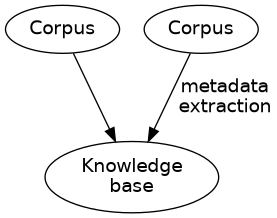
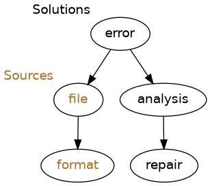

Knowledge base for file format validation errors
================================================

The articles: https://digital-preservation-finland.github.io/knowledge-base

This database contains information about the identification, characterisation, analysis and fixing of file format validation errors in a way that enables easy and efficient processing.

The purpose of this database is to help the community with the challenges on preserving content. The information in the database can be handled in accordance with the revised validation error treatment process described in https://hdl.handle.net/2142/121092.

Contribute
----------

The development is ongoing and the community may contribute by providing data to the database. The provided data may be errors that identify a problem raised by a validating software or the provided data can include also an analysis and a solution to the problem. Ideally, the errors refer to available data containing the problem so that the data could be processed with the future versions of the validating software, for example.

Data may be provided to the database by the Github's Issues functionality or by the Finnish National Digital Preservation Services' support channel mailto:pas-support@csc.fi, and in the future also by making pull requests with the help of scripts for adding and updating information. The contribution should provide at least an error. The error may be supplemented with an analysis and the analysis may be supplemented with a repair with respect to `the data model <docs/datamodel.rst>`_.

Corpora
.......

Corpora are independent collections of files and can provide information to the knowledge base via metadata extraction. The knowledge base then would refer to locations of data in a corpus, and also maintain references to locations. Access to the actual data from which the metadata is extracted may be useful when reproducing a problem, analysing it and finally when creating a fix for the problem. All the phases may be executed by a different entity and a single phase may be executed by many entities.

Model
-----

The data model consists of units of formats, files, errors, analyses and repairs. Relations between these objects in the database are unidirectional.

File objects describe unique data for errors and they refer to a format object which defines the valid and intended format for data. In the case there the data is not available, the reference is a database-wide unique identifier linking the related message from other validating software. If the data is valid, it will not be referred to from error objects.

Different errors from different validators of the same data can be grouped by the reverse relationship from file to error. An error may have many analyses and the analyses may have different repairs, proposed solutions, to the problem.

